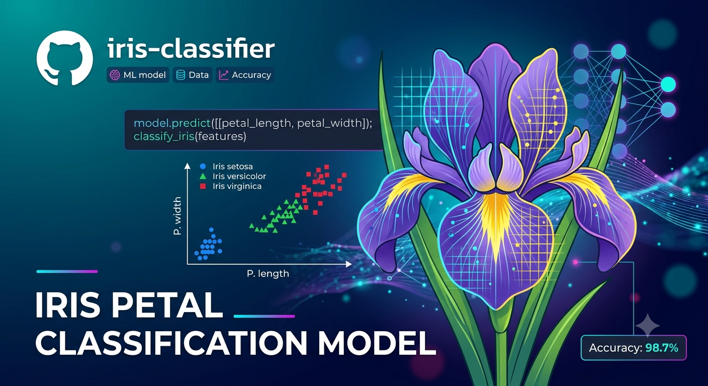
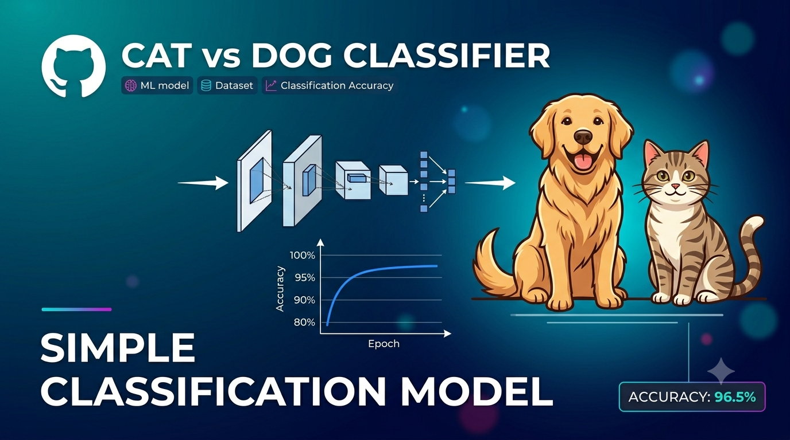

# Welcome to my GitHub portfolio!

  

I am a **lecturer and researcher with research interest in specializing in computational neuroscience**, I work on the intersection of cognitive science, computer science & neuroscience. I am passionate about teaching, mentoring, and sharing reproducible research. I am interested in using these research interest in domain neurodegenerative disorders. I am a member of ISTAART.

### My research Interests 
:four_leaf_clover: Computational Neuroscience  
:four_leaf_clover: Cognitive Systems  
:four_leaf_clover:  Artificial Intelligence.

I beilive we need to use new technology to solve current human problems rather than afraiding them. I like to focus on how to use current technology advancements to solve health related issue rather than improving them. I would like to do research with BCI which we try to finding cures and diagnosis of neurodegenerative disorders like Alzheimer's Disorder. 

  

 I like to solve puzzles. I always curious about "Why?" I like to solve problems & questions such as, 

:four_leaf_clover: How to detect neurodegenerative disorders before symptoms?  
:four_leaf_clover: Speak and communication to spinal cord injured people?  
:four_leaf_clover: New theraputics to neurodegenarative disorders  
:four_leaf_clover: Can we restored or identified brain with stroke?

### My Research Playbook

 :four_leaf_clover: I like to keep a small note book with me. I wrote important notes related to my research work there. I do the stketching works, draw diagrams for planning and get myself a clear idea about my research work before I write ideas on research paper or proposal. 

:four_leaf_clover: Sometimes I work on several projects at a time. So I put sticky notes in that note book. I allocated one color for one research. So I can easily find my notes related to that research by using that.

:four_leaf_clover: I use colored pens, highlight pens to make note taking more visible. It doesn't take me an extra effort to do. I like to keep things organize, visualize and I love to do that so it is effortless.

:four_leaf_clover: I like to do systematic reviews because I think it is giving me depth of knowledge regarding something I wanted to research. I value systematic work as much as I value research work with novelty and have implemetation works.

### Skills & Tools
<table >
  <tr>
    <td></td>
    <td></td>
    <td></td>
    <td></td>
    <td></td>
    <td></td>
    <td></td>
    <td></td>
    <td></td>
    <td></td>
    <td></td>
  </tr>
</table>

### GitHub Projects
<table>
  <tr>
    <td></td>
    <td>
      <h3>P300 Analysis</h3>
      
This project was conducted to identify P300 of the EEG signal waves by using machine learning technologies.

      
      
      
<a href="https://github.com/vranathunga/P300-EEG-Signal-Analysis.git">View Project :globe_with_meridians: </a>

    </td>
  </tr>
  <tr height="30px"></tr>
  <tr>
    <td></td>
    <td>
      <h3>EEG-Sleep-Stage-Classification</h3>
      
This project was conducted to identify P300 of the EEG signal waves by using machine learning technologies.

      
      
      
      
<a href="https://github.com/vranathunga/EEG-Sleep-Stage-Classification.git">View Project :globe_with_meridians: </a>

    </td>
  </tr>
  <tr height="30px"></tr>
  <tr>
    <td></td>
    <td>
      <h3>Iris Classification</h3>
      
This project is a CNN model creation for identifying Iris flower classification based on petal descriptions.

      
      
<a href="https://github.com/vranathunga/Iris-Classification---CNN.git">View Project :globe_with_meridians: </a>

    </td>
  </tr>
  <tr height="30px"></tr>
  <tr>
    <td></td>
    <td>
      <h3>Cat & Dog Classification</h3>
      
 This project uses a Convolutional Neural Network (CNN) to classify images of cats and dogs.

      
      
<a href="https://github.com/vranathunga/Cat-Dog---CNN.git">View Project :globe_with_meridians: </a>

    </td>
  </tr>
</table>

### Contact
<table border="0">
  <tr>
    <td>
      
    </td>
    <td>
      
    </td>
    <td>
      
    </td>
    <td>
      
    </td>
  </tr>
</table>

  

