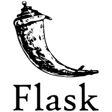
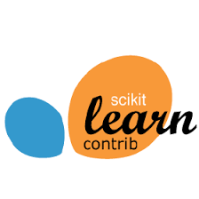
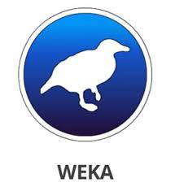
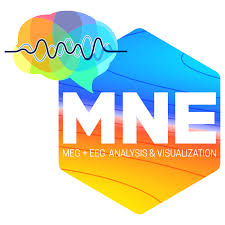
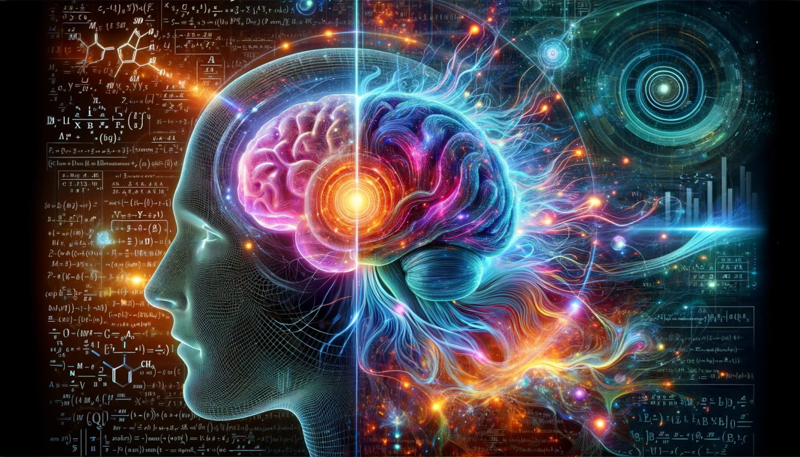
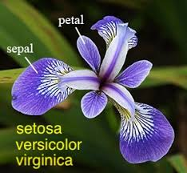
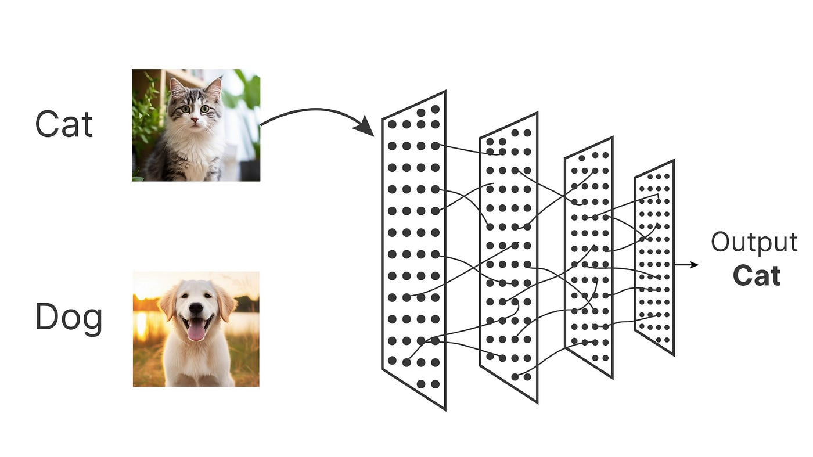
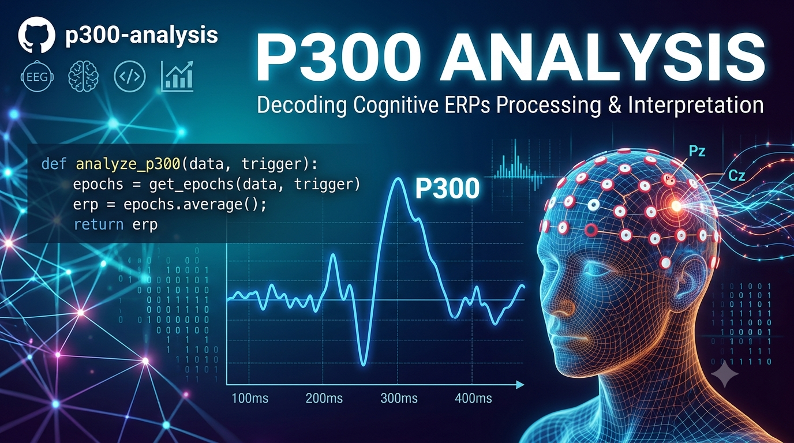

# Vindya Ranathunga – Lecturer/ Researcher 

Welcome to my GitHub portfolio! I am a **lecturer and researcher with research interest in specializing in computational neurology**, focusing on the intersection of neuroscience, Machine Learning, and Brain Logics. I am passionate about teaching, mentoring, and sharing reproducible research. My research Interests are Computational Neurology, Cognitive Systems and Artificial Intelligence.

## 🛠️ Skills & Tools

  
  
  
  
  
  
  
  
  
  
  
  

## 📈 GitHub Projects

  <table>
    <tr>
      <!-- Card 1 -->
      <td width="300px" valign="top" align="center">
        
        <h3>EEG-Sleep-Stage-Classification</h3>
        

          This project was conducted to identify the EEG signal waves identification by using machine learning technologies.
        

      </td>
      <!-- Spacer -->
      <td width="30px"></td>
      <!-- Card 2 -->
      <td width="300px" valign="top" align="center">
        
        <h3>Iris Classification</h3>
        

          This project is a CNN model creation for identifying Iris flower classification based on petal descriptions.
        

      </td>
    <!-- Spacer -->
    <td width="30px"></td>
      <!-- Card 3 -->
      <td width="300px" valign="top" align="center">
        
        <h3>Cat & Dog Classification</h3>
        

          This project uses a Convolutional Neural Network (CNN) to classify images of cats and dogs
        

      </td>
  </tr>
  <tr>
    <!-- Card 1 -->
      <td width="300px" valign="top" align="center">
        
        <h3>P300 Analysis</h3>
        

          This project was conducted to identify P300 of the EEG signal waves identification by using machine learning technologies.
        

      </td>
      <!-- Spacer -->
    <td width="30px"></td>
  </tr>
</table>

## 📫 Contact

- ✉️ Email: [vgr.grad@gmail.com](vgr.grad@gmail.com)  
- 🔗 [LinkedIn](#) | [ResearchGate](#) | [ORCID](#)  

